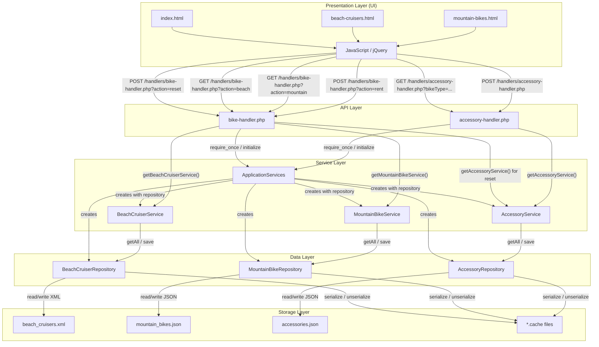

# Current Architecture

## Architecture Diagram

## Key Architectural Observations

### Strengths

- The codebase has a recognizable layered structure: static UI pages call PHP handlers, handlers call services, services call repositories, and repositories persist data.
- Bike and accessory business behavior is mostly centralized in service classes rather than being fully embedded in the HTML pages.
- Repository classes isolate file parsing and file writing from the handlers.
- The use of `ApplicationServices` gives the module one visible bootstrap point for constructing repositories and services.
- The handlers return JSON consistently and set response headers explicitly.
- The frontend request paths are straightforward and easy to trace from jQuery calls to PHP endpoint files.
- Sample data is isolated under `SampleData`, which makes the demo persistence model easy to inspect.

### Weaknesses

- ApplicationServices is a static Service Locator pattern rather than Dependency Injection. This also creates hidden global dependencies and makes testing or replacement of dependencies difficult.
- The API layer is procedural and mixes routing, HTTP method validation, request parsing, response shaping, output sanitization, and service dispatch in the same files.
- Services depend on concrete repository classes instead of interfaces, so the persistence mechanism cannot be swapped without editing service construction and type hints.
- The domain model is represented by associative arrays, so field names, casing, and storage schema leak through services, handlers, and frontend code.
- Beach cruiser and mountain bike flows are duplicated across services, repositories, handlers, and frontend JavaScript.
- The UI depends directly on inconsistent response shapes: beach cruisers use `snake_case`, while mountain bikes use `PascalCase`.
- Business rules are duplicated between frontend and backend, especially the accessory bundle IDs and 10% discount calculation.
- File-based persistence uses full-file overwrites without locking, transactions, or concurrency protection.
- Serialized `.cache` files are tightly coupled to the file repositories and local filesystem.
- Manual `require_once` usage creates direct file-level coupling and no autoloading boundary.
- Deprecated PHP features are present, including `create_function()` and `each()`, which block PHP 8 compatibility.

### Modernization Direction

- Introduce Composer autoloading and namespaces to replace manual `require_once` dependency loading.
- Replace the static service locator with explicit dependency injection, even if initially done with a small bootstrap factory.
- Define repository and service interfaces so handlers depend on contracts rather than concrete implementations.
- Normalize bike and accessory data into domain objects or DTOs with consistent field names.
- Split handler responsibilities into routing/controller logic, request validation, service invocation, and response serialization.
- Consolidate duplicated bike service behavior behind a common bike service abstraction or shared domain model.
- Move accessory promotion rules into a backend policy/service and have the frontend display server-calculated totals rather than duplicating pricing logic.
- Replace file persistence with a transactional datastore for rental and stock operations.
- Remove deprecated PHP features by replacing `create_function()` with closures and `each()` with `foreach`.
- Add focused tests around rental availability, accessory stock deduction, bundle discounts, reset behavior, and repository read/write behavior before deeper refactoring.

## Architectural Risk Assessment

| Area | Risk |
|--------|--------|
| PHP 8.3 Upgrade | Medium |
| Business Logic Refactoring | Low |
| UI Modernization | Low |
| Persistence Layer | High |
| Scalability | High |
| Maintainability | High |
| Testing Confidence | Medium |

### Overall Assessment

The application is functional and understandable but exhibits several legacy architectural patterns that reduce maintainability and scalability. The modernization effort can be performed incrementally with relatively low business risk while significantly improving code quality and future extensibility.